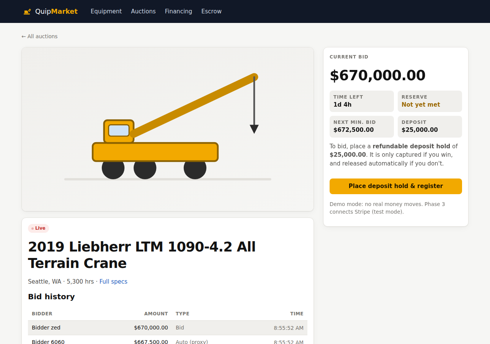
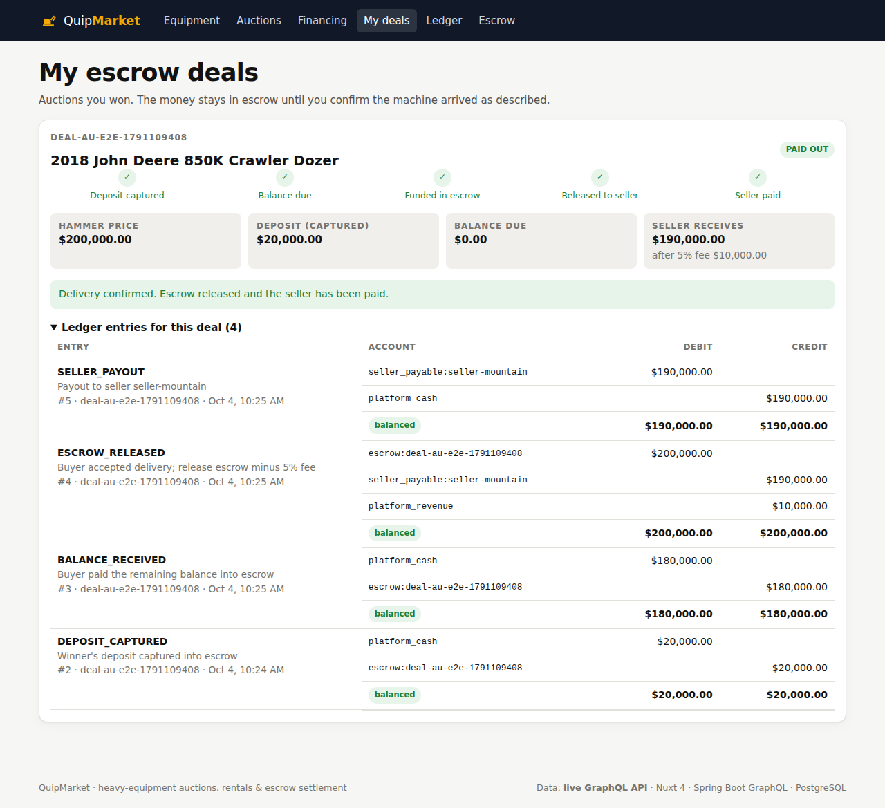
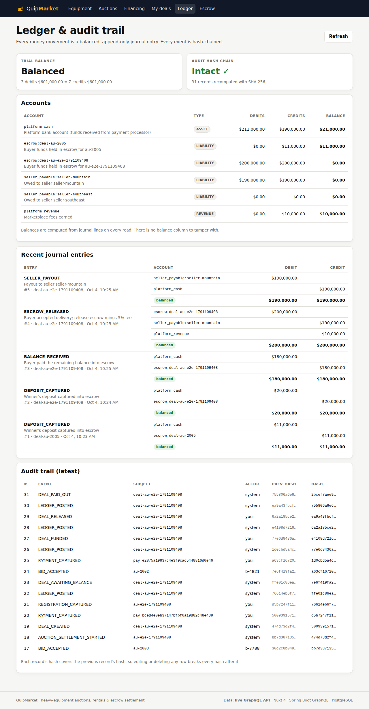

# QuipMarket

[](https://github.com/Cathy0326/B2BPlatform/actions/workflows/ci.yml) [](https://github.com/Cathy0326/B2BPlatform/actions/workflows/security.yml) [](https://github.com/Cathy0326/B2BPlatform/actions/workflows/mobile.yml) [](docs/QUALITY.md) [](docs/QUALITY.md) [](docs/QUALITY.md) [](docs/QUALITY.md)

**Heavy-equipment auctions, rentals & escrow settlement**, a B2B marketplace where bids can't race, bookings can't double-book, and every dollar is traceable through a double-entry ledger.

**Live demo:** [quipmarket.cathyyue0326.workers.dev](https://quipmarket.cathyyue0326.workers.dev) (Cloudflare Workers; auctions, escrow deals and the ledger are simulated in your browser with the same rules as the backend; the full stack runs locally with Docker Compose)

| Live auction | Escrow deal | Ledger & audit |
|---|---|---|
|  |  |  |

## Tech stack

| Layer | Tech |
|---|---|
| Frontend | Nuxt 4 (Vue 3, TypeScript, SSR), Stripe Elements, Auth0 SPA SDK |
| Mobile | Kotlin Multiplatform: shared money rules, rental pricing and an Apollo Kotlin GraphQL client for Android (Jetpack Compose app) and iOS (XCFramework), tested on JVM, Android and the iOS simulator |
| Backend | Java 21, Spring Boot 4.1, Spring for GraphQL (queries, mutations, WebSocket subscriptions), modular monolith verified by Spring Modulith |
| Data | PostgreSQL 16, Flyway, plain SQL via `JdbcClient`, LISTEN/NOTIFY for cross-replica events |
| Payments | `PaymentGateway` strategy: simulated (default) or Stripe test mode (PaymentIntents, manual capture, signed webhooks) |
| Money & audit | Double-entry ledger (balanced and append-only, enforced by PostgreSQL), SHA-256 hash-chained audit log |
| Security | Auth0 (OAuth2/JWT, issuer + audience validation, roles), token-bucket rate limiting, GraphQL depth/complexity limits; secrets committed encrypted with SOPS + age (one key per environment); default-deny NetworkPolicies, Pod Security `restricted`, Linode Cloud Firewall; CodeQL, Trivy, gitleaks and SpotBugs + Find Security Bugs in CI |
| Delivery | Docker (multi-stage, non-root), GitHub Actions (every push deploys to a throwaway kind cluster and smoke-tests it), Kubernetes on containerd (kustomize overlays for dev, staging, production), OpenTofu (Linode LKE, managed PostgreSQL, Cloudflare DNS; a workspace and encrypted remote state per environment) |
| Environments | dev, staging and production; every merge to `main` deploys to staging, a `v*` tag promotes the same image digests to production after approval |

## Highlights

- **Live auctions**: proxy (max) bidding with price-then-time priority, a 2-minute soft close against sniping, and reserve prices. Updates are pushed over WebSockets.
- **Concurrency-safe by construction**:
  - a PostgreSQL `EXCLUDE` constraint makes double booking impossible
  - a per-lot row lock serializes bids
  - both are proven by 40–50-thread race tests
- **Escrow settlement**:
  - deposits are card *authorizations*, and losing bidders' holds are voided automatically
  - the winner's deposit is captured and the balance paid into escrow
  - the seller is paid only after the buyer confirms delivery
- **Fintech-grade money handling**:
  - every movement is a balanced journal entry
  - `Idempotency-Key` on money-moving mutations
  - a saga with deterministic provider idempotency keys
  - de-duplicated, signature-verified webhooks
  - a tamper-evident audit chain
- **No N+1**: nested GraphQL fields are batched, and a test counts SQL statements.
- **Rentals & financing**: the cheapest day/week/month mix (dynamic programming), a next-free-window suggestion, and amortization schedules computed in integer cents.

## Run it

**Frontend only (mock data, no backend):**
```bash
cd frontend && npm install && npm run dev        # http://localhost:3000
```

**Everything in containers:**
```bash
docker compose --profile app up --build          # frontend :3000 · API :8080/graphql · GraphiQL :8080/graphiql
```

**Develop locally (Docker for the DB + JDK 21 + Node 22):**
```bash
docker compose up -d db
cd backend  && ./mvnw spring-boot:run -Dspring-boot.run.profiles=demo
cd frontend && NUXT_PUBLIC_GRAPHQL_URL=http://localhost:8080/graphql npm run dev
```

**Tests:**
```bash
cd frontend && npm test && npm run typecheck     # 188 unit and property tests (npm run test:ci adds coverage + the coverage gate)
cd frontend && npm run build && npm run test:e2e  # 40 browser tests: user journeys + axe accessibility, desktop and phone
cd backend  && ./mvnw verify                     # 157 unit and property + 70 Testcontainers integration tests + JaCoCo coverage gate
cd backend  && ./mvnw org.pitest:pitest-maven:mutationCoverage   # mutation testing of the money rules (gate 95%)
```

Windows (PowerShell) steps, Stripe test mode and Auth0 setup are in the handover docs.

## Quality

**455 automated tests, 100% passing on `main`** · backend coverage **94% lines / 85% branches** (unit + integration) · frontend logic coverage **99% lines / 89% branches** · **mutation score 99%** on the money and auction rules · property-based tests (jqwik, fast-check) · browser journeys and WCAG accessibility checks (Playwright, axe) · CI fails if coverage or mutation score drops below its floor · CodeQL, Trivy, gitleaks, SpotBugs and ESLint on every push · every push deploys to a throwaway Kubernetes cluster and smoke-tests it.

```
  kind deploy + smoke test       1   real Kubernetes: probes, DNS, SSR → API → PostgreSQL, Pod Security, NetworkPolicy
  browser (Playwright + axe)    40   buyer journeys, WCAG 2.1 AA on every page, light/dark, desktop/phone
  integration (Testcontainers)  70   real PostgreSQL 16, 50-thread race tests, GraphQL API, randomized ledger model
  unit + property-based        345   money rules, auction engine, ledger, API clients (JUnit, jqwik, Vitest, fast-check)
  mutation testing (PIT)       99%   of 131 planted bugs in the money and auction rules are caught
```

Each CI run's *Summary* tab shows the full report: pass rate per suite, failing tests by name, coverage per module, and the mutation score with any surviving mutants. See [docs/QUALITY.md](docs/QUALITY.md) for the approach, and for how it maps to testing practices common at financial and trading firms.

## Documentation

| Doc | What's inside |
|---|---|
| [Phase 1](docs/handover/phase-1.md) | Nuxt frontend: catalog, auctions, rentals, financing |
| [Phase 2](docs/handover/phase-2.md) | Spring Boot GraphQL + PostgreSQL, concurrency, N+1, subscriptions |
| [Phase 3](docs/handover/phase-3.md) | Payments (Stripe), escrow saga, double-entry ledger, idempotency, webhooks, audit chain |
| [Phase 4](docs/handover/phase-4.md) | Auth0, rate limiting, LISTEN/NOTIFY, Docker, CI, Kubernetes, OpenTofu |
| [Phase 5](docs/handover/phase-5.md) | Environments and deploy pipeline, SOPS secrets, hardening, Kotlin Multiplatform, ClickUp workflow |
| [Phase 6](docs/handover/phase-6.md) | Property-based tests (jqwik, fast-check), mutation testing (PIT), Playwright browser tests and axe accessibility checks |
| [Mobile](mobile/README.md) | Kotlin Multiplatform shared module, Android app, iOS framework, the money-rule contract shared by all clients |
| [Quality](docs/QUALITY.md) | Test pyramid, pass rate and coverage, security scanning and static analysis, enterprise testing practices |
| [Capstone](docs/CAPSTONE.md) | Architecture, resume bullets, interview stories, demo script |
| [Deployment](docs/DEPLOYMENT.md) | Environments, the build-once / promote-by-digest pipeline, release and rollback, secrets (SOPS), hardening, containerd |
| [Contributing](CONTRIBUTING.md) | ClickUp ↔ GitHub workflow: branch and commit naming, pull request template, definition of done |

**Related:** [order-book-engine](https://github.com/Cathy0326/order-book-engine), a Java 21 limit order book matching engine with differential testing and JMH/HdrHistogram latency measurements.

## Roadmap

| Phase | Scope | Status |
|---|---|---|
| 1 | Nuxt frontend with mock data | ✅ |
| 2 | Spring Boot GraphQL + PostgreSQL: catalog, rentals, authoritative auction engine, live updates | ✅ |
| 3 | Ledger, escrow, idempotency, Stripe test mode, webhooks, audit hash chain | ✅ |
| 4 | Auth0, rate limiting, multi-replica events, Docker, CI, Kubernetes, OpenTofu | ✅ |
| 5 | dev/staging/prod with promote-by-digest deploys, SOPS secrets, Pod Security + NetworkPolicies, Kotlin Multiplatform mobile | ✅ |
| 6 | Property-based tests, mutation testing gated at 95%, browser journeys and WCAG accessibility checks in CI | ✅ |
