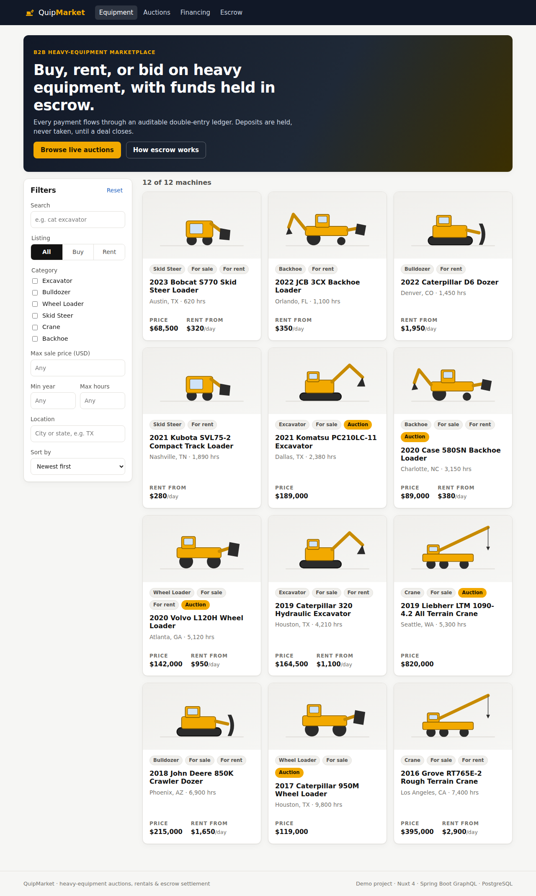
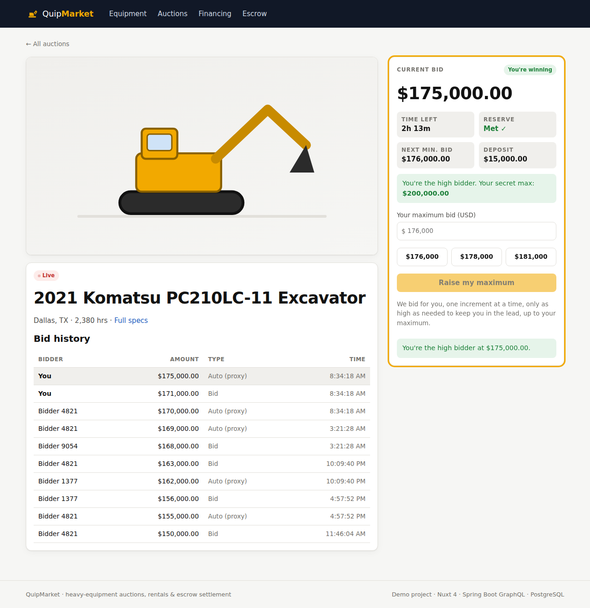
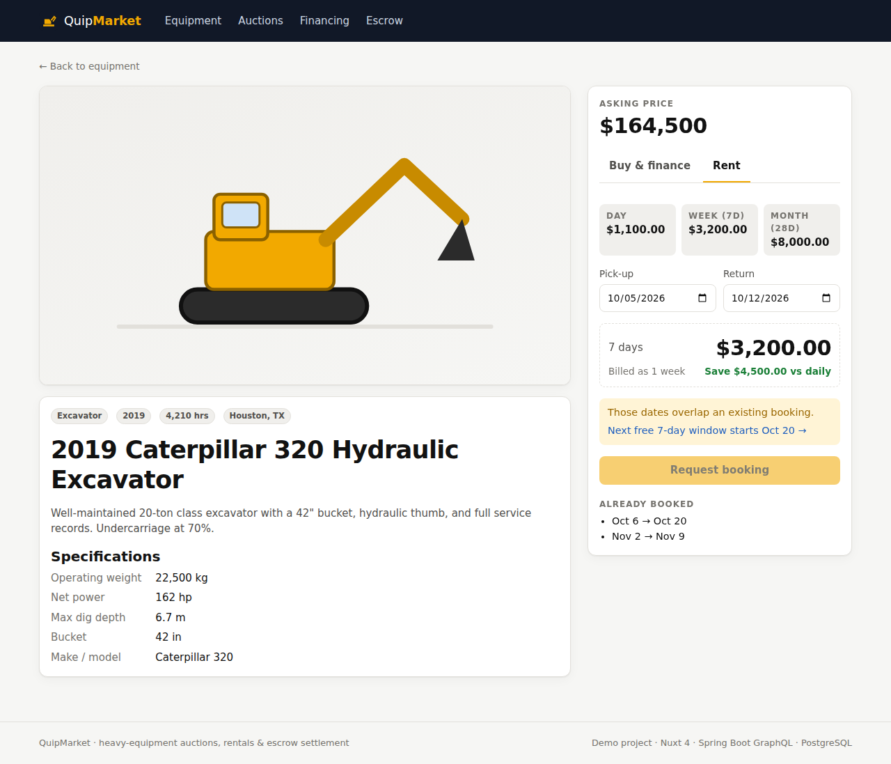
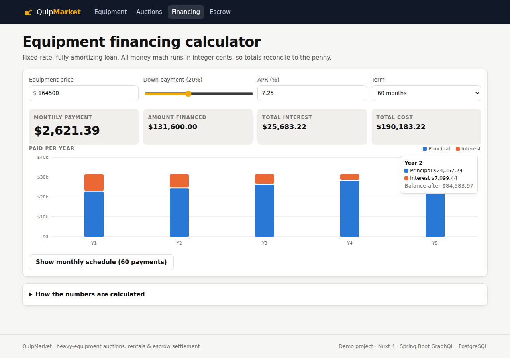

# Phase 1 Handover: Nuxt Frontend (mock data)

> **Status:** ✅ Complete · 57 unit tests passing · typecheck clean · production build OK · checked in Chromium (desktop, mobile, dark mode)
>
> **Folder:** `frontend/`

---

## 0. TL;DR

A working Nuxt 4 marketplace with four flows: browse equipment, bid in live auctions, quote a rental, and finance a purchase. All business rules live in **pure, tested TypeScript functions** (`app/utils/`). The UI talks to the data through an **interface** (`EquipmentApi`, `AuctionApi`). Phase 1 ships a mock implementation of that interface, and Phase 2 swaps in GraphQL without touching any page.

| Catalog | Auction room |
|---|---|
|  |  |
| **Rental quote** | **Financing** |
|  |  |

---

## 1. How to run on Windows

**Step 1 — Install Node.js 22 LTS**
Download from <https://nodejs.org> (LTS), then open a **new** PowerShell and check:
```powershell
node -v   # v22.x
npm -v
```

**Step 2 — Get the code**
```powershell
git clone https://github.com/Cathy0326/B2BPlatform.git
cd B2BPlatform
cd frontend
npm install          # also runs `nuxt prepare`, which generates .nuxt/ types
```

**Step 3 — Run**

| Command | What it does |
|---|---|
| `npm run dev` | Dev server with hot reload → <http://localhost:3000> |
| `npm test` | 57 unit tests (Vitest) |
| `npm run test:watch` | Re-run tests on save |
| `npm run typecheck` | TypeScript strict check |
| `npm run build` then `node .output/server/index.mjs` | Production build + preview |

> 💡 If `npm test` says *"Failed to load tsconfig .nuxt/tsconfig.app.json"*, run `npx nuxt prepare` once.

**Step 4 (optional) — Deploy to Cloudflare Pages**
1. Cloudflare dashboard → *Workers & Pages* → *Create* → *Pages* → connect the GitHub repo.
2. Root directory: `frontend` · Build command: `npm run build` · Framework preset: **Nuxt.js** (Cloudflare sets `NITRO_PRESET=cloudflare_pages` automatically).
3. You get a free `*.pages.dev` URL → put it in your Upwork proposal.

---

## 2. Big picture

### 2.1 Layers: who is allowed to call whom

```
┌───────────────────────────────────────────────────────────────┐
│ pages/            URL → screen. SSR for SEO pages.            │  "what to show"
│  index · equipment/[id] · auctions · auctions/[id] · financing│
├───────────────────────────────────────────────────────────────┤
│ components/       Reusable UI. Props in, events out.          │  "how it looks"
│  BidPanel · LoanCalculator · RentalQuotePanel · ...           │
├───────────────────────────────────────────────────────────────┤
│ composables/      State + side effects (fetch, timers, URL).  │  "glue"
│  useAuctionRoom · useEquipmentCatalog · useRentalQuote · ...  │
├───────────────────────────────────────────────────────────────┤
│ services/         Data-source INTERFACES + mock impl.         │  "where data lives"
│  EquipmentApi · AuctionApi   (Phase 2: GraphQL impl)          │
├───────────────────────────────────────────────────────────────┤
│ utils/            PURE business rules. No Vue, no I/O.        │  "the rules"  ← 57 tests
│  auction · rentalPricing · dateRange · loan · money · filters │
└───────────────────────────────────────────────────────────────┘
        arrows only point DOWN: utils never imports Vue
```

**Why this matters:** The rules (`utils/`) are the most valuable and most error-prone code, so they are pure functions, the easiest kind to test. Phase 2 re-implements the same rules in Java with the **same test cases**.

### 2.2 One proxy bid, end to end

```
User types max $200,000 ──► BidPanel  ── emit('bid', 20_000_000 cents)
                                │
                                ▼
                     useAuctionRoom.bid()
                                │  api.placeBid(auctionId, 'you', max)
                                ▼
                     mock AuctionApi            (Phase 2: GraphQL mutation)
                       1. deposit hold exists?  ── no ──► NotRegisteredError
                       2. utils/auction.placeBid(auction, bidder, max, now)
                             ├─ status LIVE?          else NOT_STARTED / ENDED
                             ├─ max ≥ minimum next?   else TOO_LOW
                             ├─ compare with leader's SECRET max
                             │     higher → new leader, price = oldMax + increment
                             │     lower/equal → leader stays (tie: EARLIER wins)
                             ├─ reserve jump
                             └─ soft close: last 2 min → endsAt = now + 2 min
                       3. save + notify subscribers (other tabs/bots)
                                │
                                ▼
                     publicView() strips leaderMaxCents for everyone but the leader
                                │
                                ▼
                     UI: "You're the high bidder at $175,000.00"
```

### 2.3 Catalog filter loop

```
   URL ?cat=EXCAVATOR&maxPrice=200000
        │ filterFromQuery()            (validates junk → defaults)
        ▼
   filter (computed) ──► applyFilter(all, filter) ──► visible cards
        ▲
        │ router.replace({ query: filterToQuery(next) })
   user clicks a checkbox
```
**Single source of truth = the URL**, so links can be shared, refresh keeps the filters, and the back button works.

---

## 3. File map

| File | Purpose | Read first? |
|---|---|---|
| `app/utils/auction.ts` | Proxy bidding engine, soft close, reserve, settlement | ⭐⭐⭐ |
| `app/utils/rentalPricing.ts` | Cheapest day/week/month mix (**LC 983 DP**) | ⭐⭐⭐ |
| `app/utils/dateRange.ts` | Half-open ranges, overlap, **merge intervals**, next free window | ⭐⭐⭐ |
| `app/utils/loan.ts` | Amortization in integer cents | ⭐⭐ |
| `app/utils/money.ts` | Cents formatting/parsing without float errors | ⭐⭐ |
| `app/utils/filters.ts` | Filter/sort + URL ⇄ filter | ⭐ |
| `app/services/auctionApi.ts` | `AuctionApi` interface, deposit holds, mock server with rival bots | ⭐⭐ |
| `app/services/equipmentApi.ts` | `EquipmentApi` interface + mock bookings | ⭐ |
| `app/composables/useAuctionRoom.ts` | Auction page state: load, subscribe, register, bid | ⭐⭐ |
| `app/composables/useRentalQuote.ts` | Dates → conflicts → quote → booking | ⭐ |
| `app/composables/useNow.ts` | SSR-safe ticking clock | ⭐ |
| `app/components/AmortizationChart.vue` | Hand-written SVG stacked bar chart | ⭐ |
| `app/data/*.ts` | Mock inventory and auctions (Phase 2 seeds the DB with the same data) | |
| `tests/*.test.ts` | 57 unit tests | ⭐⭐ |

---

## 4. Key concepts, explained small

### 4.1 Money as integer cents
- **What:** `$1,250.50` is stored as `125050`. Dollars only appear in `formatCents()`.
- **Why:** `0.1 + 0.2 === 0.30000000000000004`. Integers up to 2⁵³ are exact.
- **Trap:** `12.34 * 100 = 1233.9999999999998`. So `parseDollarsToCents()` splits the string at the dot instead of multiplying.
- **Interview line:** *"I keep money as integer minor units end to end and only format at the edge. In Java I'll use `long` cents or `BigDecimal` with explicit rounding."*

### 4.2 Proxy bidding + price-time priority
- **What:** You submit a **secret max**. The system bids for you, only as high as needed.
- **Visible price** = second-highest max + one increment, capped at the leader's max.
- **Tie:** equal maxes → the **earlier** bidder keeps the lead. This is the same *price-time priority* rule an exchange order book uses.
- **Privacy:** `publicView()` hides `leaderMaxCents`. Leaking it would let rivals bid exactly one increment above it.

### 4.3 Soft close
- **What:** A bid in the last 2 minutes pushes `endsAt` to `now + 2 min`.
- **Why:** Without it, "snipers" bid one second before the end so no one can respond. It is fairer to sellers, who get the real market price.

### 4.4 Half-open date ranges `[start, end)`
- `end` = return day, and the machine is free again that day.
- **Length** = `end − start`, with no `+1` bugs.
- **Overlap test:** `a.start < b.end && b.start < a.end`
- Back-to-back `[Oct 6, Oct 13)` + `[Oct 13, Oct 20)` → **not** an overlap ✅
- Dates become integer day numbers via `Date.UTC`, so **daylight-saving time can't shift them** (there's a test for the Nov 1 DST change).

### 4.5 Rental pricing = LeetCode 983
```
dp[i] = min( dp[i-1] + daily, dp[max(0,i-7)] + weekly, dp[max(0,i-28)] + monthly )
```
- `max(0, …)` = a block may **overhang**: buying a week for 3 days is fine if a week is cheaper.
- **Reconstruct** the choice by walking `choice[]` backwards → "1 month + 1 week".
- Industry fact: rental "month" = **28 days** (4 weeks).

### 4.6 SSR and hydration
- **Equipment pages are SSR:** Google sees title, price and specs (`useSeoMeta`).
- **Auction pages are client-only** (`useAsyncData(..., { server: false })`) because the state is live and depends on the clock.
- **Hydration mismatch** = the HTML from the server differs from the first client render. `useNow()` starts at `0` on both sides and only starts ticking in `onMounted`.

### 4.7 Dependency inversion for data
```ts
interface AuctionApi { get(); placeBid(); subscribe(); ... }
createMockAuctionApi()      // Phase 1
createGraphqlAuctionApi()   // Phase 2, same shape
```
Pages call `useAuctionApi()` and never know which implementation they got.

---

## 5. Real bugs found while building (great interview stories)

| # | Bug | Root cause | Fix | Lesson |
|---|---|---|---|---|
| 1 | Search "cat" returned a **Bob*cat*** | Plain substring match | Word-**prefix** match | Write the test with a tricky example first |
| 2 | Auction page logged *"Hydration mismatch"* | Server rendered "not found" while the client rendered "loading" (`status` was `idle` on the server) | Treat `idle` as loading | Client-only data must render the **same placeholder** on both sides |
| 3 | After bidding, the panel asked me to **register again** | A live update replaced the cached payload, so `hold` went back to `null` | Write `hold` into the cached payload | Derived state must have **one source of truth** |
| 4 | No side margin on phones | `.page { padding: 24px 0 }` overrode `.container`'s 16px | Only set vertical padding | Shorthand properties silently reset other sides |
| 5 | Chart labels huge on desktop, tiny on mobile | A fixed SVG `viewBox` scales the text too | `ResizeObserver` → draw at real pixel width | SVG text scales with the viewBox |

> Bugs #2–#5 were found by **actually running the app in a browser** (Playwright screenshots), not by unit tests. Tests prove the logic; only running the app proves the product.

---

## 6. Self-test (retrieval practice)

**Rule:** Answer out loud in English **before** opening the answer. Getting it wrong first and then checking makes it stick (*Make It Stick*, ch. 2).

<details><summary>Q1. Alice max $70,000, Bob max $60,000, increment $500. Who leads, at what price?</summary>

Alice leads at **$60,500** = Bob's max + one increment (still ≤ Alice's max).
</details>

<details><summary>Q2. Same, but Bob's max is exactly $70,000. Who leads?</summary>

**Alice**, at $70,000. Equal price → time priority → the earlier bidder wins.
</details>

<details><summary>Q3. Bookings [Oct 1, Oct 5) and [Oct 5, Oct 8). Overlap? Why does it matter which convention you pick?</summary>

No, because ranges are half-open. With inclusive end dates they would overlap on Oct 5, and the second customer would be wrongly rejected. Pick one convention and test the boundary.
</details>

<details><summary>Q4. Why does the rental DP use dp[max(0, i-7)] instead of skipping when i &lt; 7?</summary>

A week can **overhang** the rental. For 3 days, a $3,200 week beats 3 × $1,100 = $3,300 daily.
</details>

<details><summary>Q5. Why is the last loan payment slightly different?</summary>

Each month's interest is rounded to cents, and those rounding errors accumulate. The last payment absorbs the residue so the balance is exactly 0, which is what real lenders do.
</details>

<details><summary>Q6. Why are auction pages client-only but equipment pages SSR?</summary>

Equipment pages need SEO and are deterministic. Auction state is live and clock-dependent, so server HTML would already be stale and would cause hydration mismatches.
</details>

<details><summary>Q7. What would go wrong if the API returned leaderMaxCents to every viewer?</summary>

Rivals could bid exactly one increment above the leader's secret max and always win at the minimum price. That breaks the fairness of proxy bidding.
</details>

<details><summary>Q8 (design). In Phase 1 the auction engine runs in the browser. Why is that unacceptable in production?</summary>

The client is untrusted: anyone can edit JS and fake bids or the clock. Phase 2 makes the **server** the single authority (Java engine + a DB row lock per auction); the browser only displays.
</details>

---

## 7. Anki cards (NeetCode patterns used in this phase)

> Self-contained: each card makes sense on its own.

**Card 1 — Interval overlap (Meeting Rooms, LC 252)**
- **Front:** Two half-open intervals `[a.start, a.end)` and `[b.start, b.end)`. Write a one-line boolean that is true iff they overlap. Watch out: touching endpoints (`a.end == b.start`) must NOT count as overlap.
- **Back:**
  ```ts
  const overlaps = (a, b) => a.start < b.end && b.start < a.end
  ```

**Card 2 — Merge intervals (LC 56), touching also merges**
- **Front:** Given unsorted intervals, merge every overlapping **or touching** pair into continuous blocks. Don't mutate the input. Complexity? Key step before the sweep?
- **Back:**
  ```ts
  function merge(xs) {
    const s = [...xs].sort((a, b) => a.start - b.start)   // O(n log n)
    const out = []
    for (const x of s) {
      const last = out.at(-1)
      if (last && x.start <= last.end) last.end = Math.max(last.end, x.end)
      else out.push({ ...x })                             // copy: don't mutate input
    }
    return out
  }
  ```

**Card 3 — Minimum cost for tickets (LC 983), all days are travel days**
- **Front:** Cover N consecutive days with passes: 1-day (d), 7-day (w), 28-day (m). Passes may extend past day N. Write the DP recurrence and base case. Time/space?
- **Back:**
  ```ts
  dp[0] = 0
  for (let i = 1; i <= N; i++)
    dp[i] = Math.min(dp[i-1] + d, dp[Math.max(0, i-7)] + w, dp[Math.max(0, i-28)] + m)
  // O(N) time, O(N) space; Math.max(0, …) = overhang allowed
  ```

**Card 4 — Earliest free slot of length k**
- **Front:** Bookings (maybe overlapping, unsorted) and a desired start `from`, length `k`. Find the earliest start ≥ `from` with no conflict. Hint: what do you do to the bookings first?
- **Back:**
  ```ts
  let t = from
  for (const [s, e] of merge(bookings)) {   // merged + sorted
    if (t + k <= s) break                   // fits before this block
    if (t < e) t = e                        // collides → jump to block end
  }
  return t
  ```

---

## 8. Known limitations → what Phase 2 fixes

| Limitation now | Phase 2 |
|---|---|
| Auction engine runs in the browser (untrusted) | Java engine on the server + `SELECT … FOR UPDATE` row lock per auction |
| Data resets on refresh (in-memory mock) | PostgreSQL + Flyway migrations, seeded with the same data |
| Booking overlap is checked in JS only | PostgreSQL `EXCLUDE USING gist` constraint, so the DB itself refuses overlaps |
| "Live" updates come from local bots | GraphQL subscriptions (WebSocket) pushed by the server |
| Fixed demo user `you` | Auth0 login (Phase 4) |
| Deposit hold is a flag | Ledger + Stripe PaymentIntent with `capture_method=manual` (Phase 3) |

---

## 9. How to study this phase

**Principles (from *Make It Stick*):**
1. **Generation:** Before reading `utils/auction.ts`, write `placeBid()` yourself from section 4.2, then run `npm test`. Failing tests tell you exactly which rule you missed.
2. **Retrieval:** Tomorrow, draw diagram 2.1 on blank paper from memory, then compare.
3. **Spacing:** Re-do the self-test in 1 day, 3 days, and 7 days.
4. **Interleaving:** Pair one NeetCode Intervals problem with re-reading `dateRange.ts` on the same day.

**Concrete drills:**
- 🔁 **Break-it drill:** Change `<` to `<=` in `overlaps()` and run the tests. Which test fails, and why?
- 🔁 **Explain drill:** In 60 seconds, explain soft close to a non-engineer, in English.
- 🔁 **Extend drill:** Add a 3-day "weekend" rate to `quoteRental`. Only the recurrence changes, which shows why the DP is written that way.

---

## 10. PR text to paste (you open the PR yourself)

**Title:**
```
Phase 1: Nuxt 4 frontend — catalog, live auctions, rentals, financing (mock data)
```

**Body:**
```markdown
## Summary
- Nuxt 4 + TypeScript frontend for QuipMarket (heavy-equipment auctions, rentals, escrow).
- Proxy-bidding auction engine with price-time priority, soft close and reserve prices.
- Rental quotes via DP (cheapest day/week/month mix), overlap detection, next free window.
- Financing calculator with an integer-cents amortization schedule and SVG chart.
- Data access behind `EquipmentApi` / `AuctionApi` interfaces (mock now, GraphQL in Phase 2).

## Testing
- 57 unit tests (Vitest) for all business rules: `npm test`
- `npm run typecheck` clean, `npm run build` OK
- Manually verified in Chromium: desktop, 390px mobile, dark mode; no console errors

## Docs
- docs/handover/phase-1.md
```

> 💡 To keep only yourself on `main`, merge with **"Squash and merge"**, then delete the branch.
